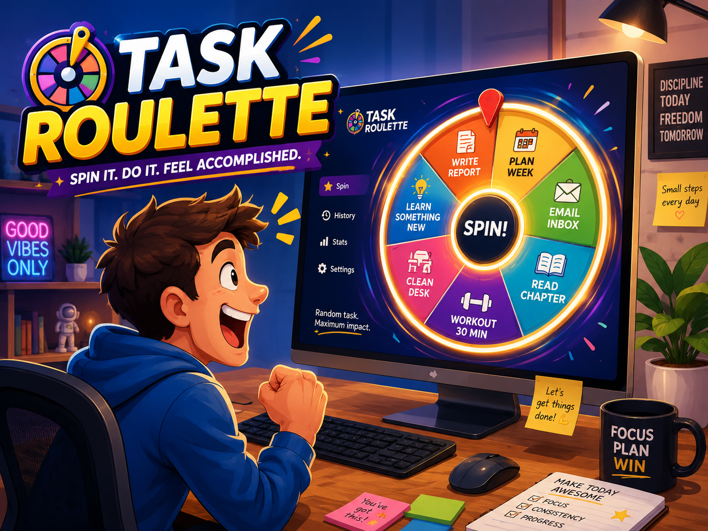

# Task Roulette




A macOS menu-bar app that picks your next task for you — built for the "I have a list and
I'm frozen on where to start" flavor of decision paralysis. Store the things you **need to
do** and the things you **want to do**, then spin a weighted roulette and just do the one
it lands on.

## What is it

If you have ADHD (or just an overloaded list), the hardest part often isn't *doing* a
task — it's *choosing* one. Task Roulette removes the choice: you keep a small pool of
tasks, hit a global hotkey, and a slot-machine reel hands you exactly one thing to start.

It lives in your menu bar (no Dock icon), opens instantly from anywhere with a hotkey, and
stores everything locally on your Mac — no account, no cloud, no network calls.

## Features

- 🎰 **Slot-reel spin** — a satisfying decelerating reel that lands on your next task.
- ⚖️ **Weighted by priority** — higher-priority tasks come up more often (not pure random).
- 🎯 **Need / Want / Both modes** — choose your intent before spinning so the wheel can't
  hand you a treat while you're avoiding real work.
- 🔁 **Smart lifecycle** — one-shot tasks disappear when done; recurring chores stay.
- 🔥 **Stats & streaks** — today's count, day streak, and recent completions.
- ⌨️ **Global hotkeys** — open and spin from any app, no Accessibility permission needed.
- 🔒 **Private by design** — local-only storage, zero network access.

## How it works

**The selection is the product, not the animation.** Pure random surfaces tasks you can't
act on, and once you start ignoring the wheel the tool is dead. So:

- **Weighted random.** Each task's chance of being picked scales with its priority
  (Low / Medium / High → weights 1 / 3 / 6). The winner is chosen *before* the reel
  animates — the spin just visualizes landing on it, like every real slot machine.
- **Mode gate.** You pick **Need**, **Want**, or **Both** before spinning. Only eligible
  tasks enter the draw, so "want" tasks can't sneak in while you're dodging work.
- **Lifecycle.** Marking a task **Done** logs a completion. One-shot tasks then archive
  (gone from the wheel, kept in history); tasks flagged **Repeats** stay in the pool for
  next time. "Want" tasks are one-shot by default.
- **History survives.** Completions are stored as denormalized snapshots, so editing,
  archiving, or deleting a task never corrupts your streak or stats.

Under the hood: SwiftUI `MenuBarExtra` + an AppKit floating panel, global hotkeys via
[`KeyboardShortcuts`](https://github.com/sindresorhus/KeyboardShortcuts) (Carbon-based, no
Accessibility prompt), SwiftData for persistence, and an Xcode project generated from
`project.yml` by [XcodeGen](https://github.com/yonaskolb/XcodeGen). The pick logic
(`TaskPicker`) and stats (`StatsCalculator`) are pure and unit-tested.

### Default hotkeys (rebindable in Settings)

| Shortcut | Action |
|----------|--------|
| ⌃⌥Space  | Open / close the panel |
| ⌃⌥R      | Open and spin immediately |

## Install & run from source

A locally-built app is ad-hoc signed, which is enough to run on your own Mac — you do
**not** need an Apple Developer account to clone and use it.

**Prerequisites:** macOS 14+, [Xcode](https://apps.apple.com/app/xcode/id497799835) 16+
(required — a SwiftUI app can't be built without it), and
[XcodeGen](https://github.com/yonaskolb/XcodeGen).

```sh
brew install xcodegen        # one-time
git clone https://github.com/Mancini-Rafael/task-roulette.git
cd task-roulette
make run                     # generates the project, builds, and launches
```

`make run` builds and opens the app; look for the 🎲 in your menu bar. To keep it around,
drag `build/DerivedData/Build/Products/Debug/Roulette.app` to `/Applications`.

Common commands (`make help` lists all):

```sh
make build     # compile only
make test      # run the unit tests
make icon      # regenerate the app icon
make generate  # (re)create Roulette.xcodeproj after editing project.yml
make release   # notarized DMG — needs a Developer ID cert (see below)
```

The `.xcodeproj` is **generated** and gitignored; `make generate` recreates it. Prefer
Xcode's GUI? `make generate`, then `open Roulette.xcodeproj` and Run (⌘R).

## Distributing to others

For people to download and run it **without** Gatekeeper warnings, the app must be signed
with a **Developer ID** certificate and **notarized** by Apple — which requires the
[Apple Developer Program](https://developer.apple.com/programs/) ($99/yr). There is no way
around Gatekeeper for general distribution. Once you have a cert:

```sh
TEAM_ID=ABCDE12345 NOTARY_PROFILE=RouletteNotary make release
```

produces a notarized, stapled `Roulette.dmg`. See `scripts/build-release.sh` for the
one-time keychain/credential setup and `TODO.md` for the full release checklist.

## Project structure

```
Sources/
  App/        RouletteApp, AppDelegate, AppState, PanelController, SharedStore
  Models/     TaskItem, CompletionRecord, Enums
  Selection/  TaskPicker        (pure, unit-tested)
  Stats/      StatsCalculator   (pure, unit-tested)
  Hotkeys/    Shortcuts
  Views/      RootView, SpinView, SpinReelView, TaskListView, TaskEditorView,
              StatsView, SettingsView
  Assets.xcassets/  AppIcon
Tests/        TaskPickerTests, StatsCalculatorTests, SeededRNG
scripts/      run.sh, build-release.sh, make-icon.swift, make-icon.sh
docs/         cover art, icon preview
project.yml   XcodeGen project definition
```

## Roadmap

See [`TODO.md`](TODO.md). Highlights of what's deferred:

- Staleness-weighted picks (older un-picked tasks get a boost)
- Time-available / energy filters for stronger eligibility
- Sparkle auto-update for distributed builds
- iCloud sync, reminders

## Contributing

Contributions are welcome — issues and PRs both.

1. **Set up:** `brew install xcodegen`, then `make run` to build and launch.
2. **Make your change.** Keep the core logic (`TaskPicker`, `StatsCalculator`) pure and
   decoupled from SwiftData so it stays unit-testable.
3. **Test:** `make test` must stay green. Add tests for new logic.
4. **Commit:** use [Conventional Commits](https://www.conventionalcommits.org/)
   (`feat:`, `fix:`, `chore:`, …).
5. **Open a PR** describing the change and why.

Notes:
- Don't commit `Roulette.xcodeproj` — it's generated from `project.yml`.
- UI is SwiftUI-first; reach for AppKit only where SwiftUI can't (e.g. the floating panel
  and the status item).

## License

[MIT](LICENSE) © 2026 Rafael Lustosa Mancini
